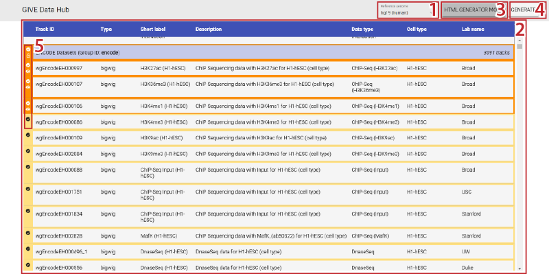
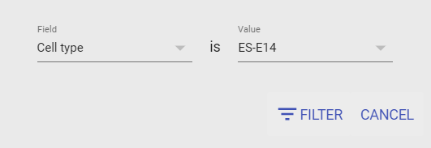

||||
| --- | --- | --- |
| [← 1. Local Deployment](1-Local_deployment_of_GIVE.md) | [↑ Index](Readme.md) | [2.2. Details of GIVE Web Components →](2.2-webComponents.md) |

# Using GIVE Web Components via GIVE Data Hub

GIVE Web Components can be used the same way you use other HTML tags, like `
` or `<video>`.

GIVE has a dedicated page named GIVE Data Hub to facilitate selection of track groups and/or tracks and generate HTML code necessary to embed a customized genome browser with GIVE Web Components.

## Table of Contents

- [Using GIVE Web Components via GIVE Data Hub](#using-give-web-components-via-give-data-hub)
  - [Table of Contents](#table-of-contents)
  - [Prerequisites](#prerequisites)
  - [Components on the GIVE Data Hub page](#components-on-the-give-data-hub-page)
  - [Selecting Datasets](#selecting-datasets)
  - [Filtering Tracks](#filtering-tracks)
    - [Applying a Filter](#applying-a-filter)
    - [Removing or Changing a Filter](#removing-or-changing-a-filter)
    - [Selecting Datasets with a Filter](#selecting-datasets-with-a-filter)
    - [Combining Multiple Filters](#combining-multiple-filters)
  - [Icons in HTML Generator Mode](#icons-in-html-generator-mode)
  - [GIVE-HUG (HTML Universal Generator)](#give-hug-html-universal-generator)

## Prerequisites

The GIVE Data Hub page of the Public GIVE Server is at <https://www.givengine.org/data-hub.html>.

***
*__NOTE:__ If you have deployed your own GIVE instance or want to use any instance other than the Public GIVE Server, you may launch the GIVE Data Hub page on your desired GIVE instance by substituting the host name with the host name of the instance.*
***

## Components on the GIVE Data Hub page

GIVE Data Hub page shows all the supported reference(s) on the instance and tracks within each reference. Please refer to the figure and the table below for all the components on the GIVE Data Hub page.

| # | Description |
| --- | --- |
| 1 | The drop-down list, used to select your reference from references on the GIVE instance. After selection, the list of tracks/groups will refresh automatically. |
| 2 | Button to apply filter on the tracks. It will turn dark when filter window is open. |
| 3 | Button to toggle HTML Generator Mode. It will turn dark when the mode is active. |
| 4 | Button to invoke [GIVE HTML Universal Generator](#give-hug-html-universal-generator). This button is shown when HTML Generator Mode is active and is enabled only when at least one track/group is selected. |
| 5 | List of all tracks and track groups (when filter is not active) in the reference. |
| 6 | Icons indicating the current status of the track group / track. They will only be shown when HTML Generator Mode is active. |

## Selecting Datasets

You may use the "HTML Generator Mode" button to start selecting tracks you would like to include in the embedded GIVE browser with the generated HTML code. The border of all tracks and track groups will become darker to indicate a selection can be made by clicking on them.

To see what the icons mean under HTML Generator Mode, please refer to [Icons in HTML Generator Mode](#icons-in-html-generator-mode) below.

## Filtering Tracks

GIVE Data Hub provides a filter mechanism for all the tracks supported. You may use the filter to show the tracks matching the metadata criterion only.

### Applying a Filter

You may filter all the tracks supported for the current reference via the FILTER button. After you click the button, the filter window will appear. You may choose the field and value for the criterion that tracks must match. For example, you can filter by cell type and specify HEK293 as the desired type.

After you click "FILTER", all the datasets generated from HEK293 will appear, and the filter button will indicate the active filter criterion to be "CELL TYPE IS HEK293".

Currently, the data type (ChIP-Seq, RNA-Seq, *etc.*), the cell line or tissue name, and the lab name of the tracks are supported.

### Removing or Changing a Filter

Once a filter is active, you may use the  button to clear it, or click the FILTER button again to change the criterion.

### Selecting Datasets with a Filter

Dataset selection is the same whether a filter is active or not. By turning "HTML Generator Mode" on, you may select datasets within the filtered tracks by clicking on them.

### Combining Multiple Filters

Applying a filter __will not affect__ any of your previous track selections and any selection under a new filter will be automatically added to the existing selection. Therefore, if you want to select a combination of tracks matching different criteria, you may click the filter button again to choose a new filtering criterion, and then choose datasets under the new filter. By doing this multiple times, you can combine selection from multiple filters to select from a variety of different metadata criteria.

## Icons in HTML Generator Mode

The following icons will appear __before track groups__ when HTML Generator Mode is active.

| Icon | Description |
| --- | --- |
|  | This group is not selected and will not be available in the resulting browser. |
|  | This group has been selected. Its tracks will be available to be chosen in the resulting browser. However, the tracks of this group are not shown by default unless they have the  icon (see below). |
|  | One or more tracks from this group has been selected to be shown by default (with a  icon). The group will not be able to be deselected until all its tracks are deselected. |

The following icons will appear __before individual tracks__ when HTML Generator Mode is active.

| Icon | Description |
| --- | --- |
|  | This track is not selected, nor is its group. It will not be available in the resulting browser. |
|  | The group of this track has been selected. It will be available to be chosen in the resulting browser. However, it will not be shown by default unless it also have the  icon. |
|  | This track has been selected to be shown by default. It will be directly shown in the resulting browser. |

## GIVE-HUG (HTML Universal Generator)

GIVE-HUG (HTML Universal Generator) can be invoked by clicking the "GENERATE" button after selecting one or mode tracks/groups. The description of components of GIVE-HUG is shown in the figure and the table below.

| # | Description |
| --- | --- |
| 1 | Labels showing the reference, groups, and tracks selected in the customized browser. |
| 2 | Select the web component to be embedded. `<chart-controller>` (full genome browser with track control, gene or coordinate input), or `<chart-area>` (chart area of a genome browser only). |
| 3 | *Optional*. If `<chart-controller>` is selected, define the title shown on the title bar of the Chart Controller.  |
| 4 | Select the display mode of the browser. __Single-window__ or __Dual-window__. |
| 5 | *Optional*. Specify the default coordinates to be shown in the resulting customized browser. If partial gene name search is supported (with a  icon), you may search for genes by providing a (partial) gene name, then selecting the gene in the prompted list. If partial name is not supported, a  icon will be shown. __Note:__ in __Dual-window__ mode, if one coordinate is specified, the other one needs to be specified as well. |
| 6 | The HTML code used to embed the browser. After the code is updated, you may make additional changes. |
| 7 | Update the HTML code after you changed any of the settings. |
| 8 | Copy the code to clipboard. Code need to be updated first if needed. |
| 9 | Save the code as a separate HTML file. Code need to be updated first if needed. |

||||
| --- | --- | --- |
| [← 1. Local Deployment](1-Local_deployment_of_GIVE.md) | [↑ Index](Readme.md) | [2.2. Details of GIVE Web Components →](2.2-webComponents.md) |
