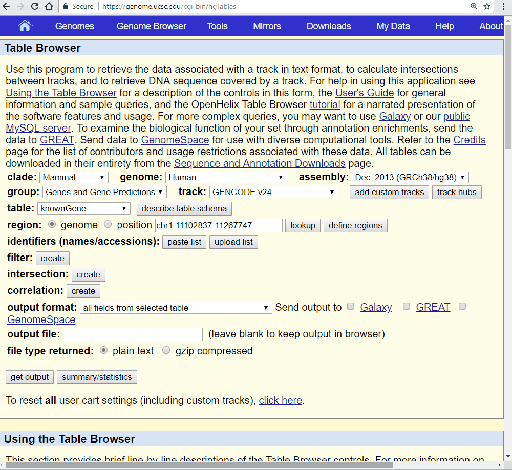

||||
| --- | --- | --- |
|[← 4.3.2. Data conversion from Hi-C contact matrices](4.3.2-HiC-conversion.md)| [↑ Index](Readme.md) | -- |

# Gene Annotation Tracks

Gene annotation track shows the locations and structures of genes and transcripts. There are many kinds of formats and sources of gene annotations, such as UCSC known gene table, GTF, GFF, bed, *etc*. Currently, GIVE only supports UCSC known gene table format. GTF/GFF support is coming in next update. Gene annotation track is set as `genePred` type in GIVE data source.

## UCSC known gene table format

UCSC known gene table format is used by UCSC known gene dataset. The UCSC Known Genes dataset is constructed by a fully automated process, based on protein data from Swiss-Prot/TrEMBL (UniProt) and the associated mRNA data from Genbank. It's a `Tab` separated 12 column text file format. Here, we describe the content of each column.

> __name__: Name of gene. This name will be shown in the gene annotation track of GIVE genome browser.
> __chrom__: Reference sequence chromosome or scaffold  
> __strand__: + or - for strand  
> __txStart__: Transcription start position (or end position for minus strand item)  
> __txEnd__: Transcription end position (or start position for minus strand item)  
> __cdsStart__:	Coding region start (or end position if for minus strand item)  
> __cdsEnd__: Coding region end (or start position if for minus strand item)  
> __exonCount__: Number of exons  
> __exonStarts__: Exon start positions (or end positions for minus strand item)  
> __exonEnds__: Exon end positions (or start positions for minus strand item)  
> __proteinID__: (Currently NOT be used in GIVE) UniProt ID, UniProt accession, or RefSeq protein ID  
> __alignID__: (Currently NOT be used in GIVE) Unique identifier (GENCODE transcript ID for GENCODE Basic)  

The gene annotation file in UCSC known gene table format can be downloaded from [UCSC table browser](https://genome.ucsc.edu/cgi-bin/hgTables). The default `name` in the first column is UCSC kgID (such as `uc031tla.1`), which will be shown in the genome browser. You might want to use gene symbol instead of the kgID. It can be done in three steps.
 - First step: In the [UCSC table browser](https://genome.ucsc.edu/cgi-bin/hgTables), choose the correct genome you need, set `group` as `Genes and Gene Predictions`, `track` as `GENCODE`, `table` as `konwnGene`, and `output format` as `selected fields from primary and related tables`. Set a file name to the `output file`. Then click the `get output` button.
 - Second step: `check all` of the knownGene fields and check `geneSymbol` of the kgXref fields. Then click the `get output` button. Then you will get the gene annotation file with geneSymbol as the last column. The following GIF animation shows a demo of the first and second steps.

 - Third step: In the annotation file got in the second step, replace the first column with the last column and delete the last column. You can use awk, sed or other tools to achieve this. We also provide a script for replacing kgID. You can get the script [replace_kgID.sh in GIVE-Toolbox](../GIVE-Toolbox/replace_kgID.sh).

## GTF Format

*Coming soon.*