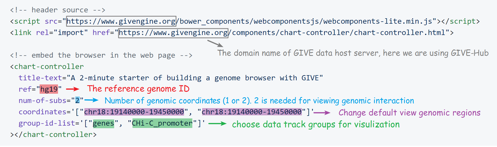
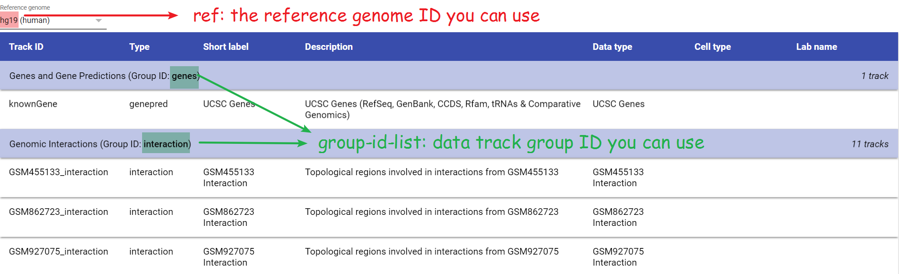

# GIVE Tutorial 0: Start from a 2 minutes example

Just copy paste the following HTML codes to [jsfiddle](https://jsfiddle.net/), an online HTML testing website for testing of your own HTML codes. 1) Go to  [jsfiddle](https://jsfiddle.net), 2) copy paste the following lines to the HTML panel (top left), 3) hit "run" button.
Congratulations! You have built your first genome browser webpage using data source from GIVE Data Hub in less than 1 minute. 
```html
<!-- header source -->
<script src="https://www.givengine.org/bower_components/webcomponentsjs/webcomponents-lite.min.js"></script> 
<link rel="import" href="https://www.givengine.org/components/chart-controller/chart-controller.html">

<!-- embed the browser in the web page -->
<chart-controller 
  title-text="A 2-minute starter of building a genome browser with GIVE" 
  ref="hg19" 
  num-of-subs="2" 
  coordinates='["chr18:19140000-19450000", "chr18:19140000-19450000"]'
  group-id-list='["genes", "CHi-C_promoter"]'
></chart-controller>
```
So you have enough time to learn some essential tips for customizing your genome browser. The following HTML code illustration figure shows nearly all the information you need. All the colored parts are useful for customization, especially for the `ref` and `group-id-list`. 



This genome browser used data source from GIVE Data Hub. There are already hundreds of public data sets available in GIVE Data Hub. You can go to the [GIVE Data Hub](https://www.givengine.org/data-hub.html) to look for other reference genomes and data track groups. You can find the values that can be used for `ref` and `group-id-list` in you genome browser HTML codes. For example, the screenshot below shows that you can add `interaction` to the `group-id-list` with `hg19` reference genome.



The following GIF animation shows the whole process of the 2 minute tutorial. It's so easy.


After the 2 minute example, I am sure that you want to learn more. We have prepared a comprehensive series of [GIVE tutorials](https://github.com/Zhong-Lab-UCSD/Genomic-Interactive-Visualization-Engine/tree/master/tutorials). Please enjoy it!

