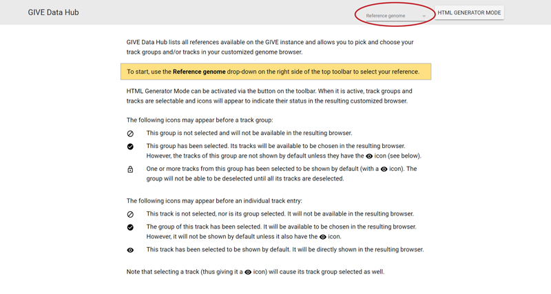
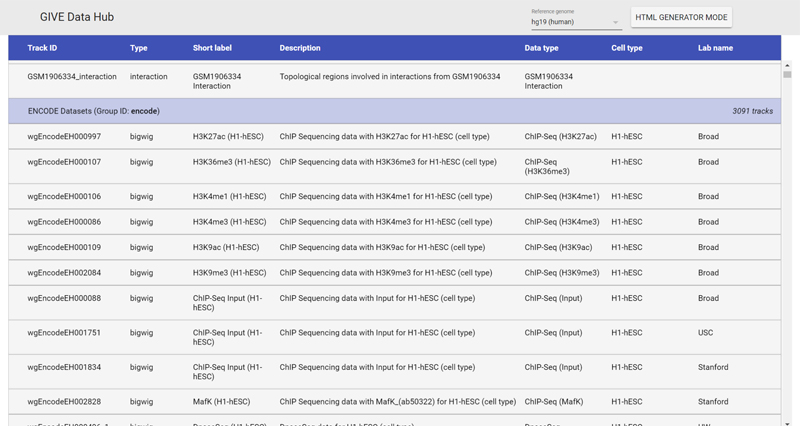
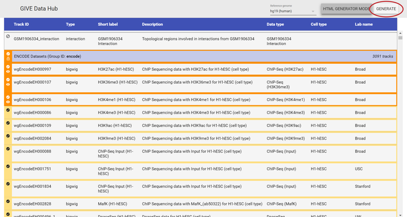
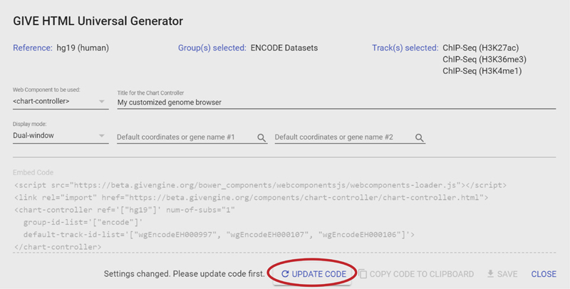
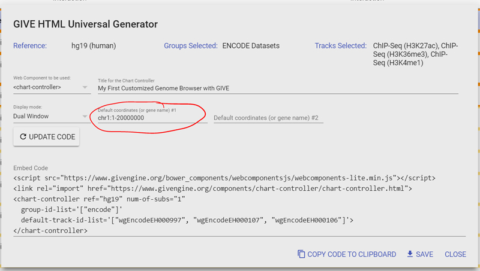
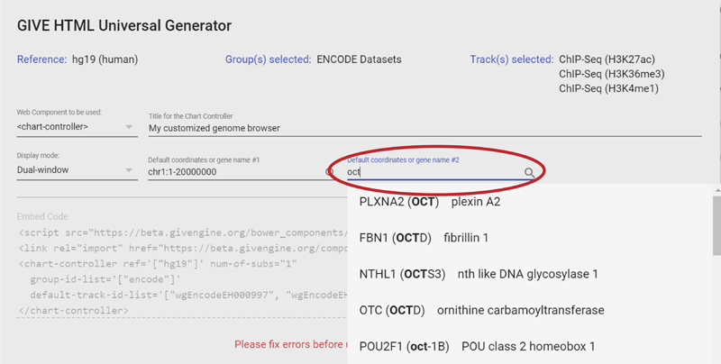

# GIVE Tutorial 1.1: Building a Customized Genome Browser with GIVE Hub

This tutorial will show you how to use the GIVE Hub page of Public GIVE Server (or installed code base and data source) to implement a customized genome browser.

## Table of Contents

*   [Prerequisites](#prerequisites)
*   [Loading references on GIVE Hub page](#loading-references-on-give-hub-page)
*   [Toggling HTML Generator mode and select track groups and tracks](#toggling-html-generator-mode-and-select-track-groups-and-tracks)
*   [GIVE HTML Embed Code Generator](#give-html-embed-code-generator)
*   [Specify the default coordinates](#specify-the-default-coordinates)
*   [Copy the embed code or download HTML file](#copy-the-embed-code-or-download-html-file)

## Prerequisites

If you use the Public GIVE Server at <https://www.givengine.org/>, there is no prerequisite to follow this tutorial. Just start by visiting <https://www.givengine.org/give-hub.html> to launch GIVE Hub page.

***
*__NOTE:__ If you want to use your own GIVE instance (or any instance other than the Public GIVE Server), please substitute the host name with the host name of your GIVE instance and launch the GIVE Hub page on that specific instance.*
***

## Loading references on GIVE Hub page

GIVE Hub page shows all the supported reference(s) on the instance and tracks within each reference. It also has an HTML Generator Mode for generation of the embed codes necessary for a customized genome browser with selected track groups and/or tracks.

When you see the GIVE Hub page, use the reference selector on top right of the page to select the reference you would like to show. For example, "hg19 (human)".

After selection GIVE Hub page will refresh with all available tracks within the reference, grouped by their track groups.

## Toggling HTML Generator mode and select track groups and tracks

GIVE Hub can be switched into an "HTML Generator Mode", in which track groups and individual tracks can be selected for the embedded browser. Click on "HTML GENERATOR MODE" to enable this mode.
When the HTML Generator Mode is active, a button named "GENERATE" will appear to the right of the "HTML GENERATOR MODE" button, the borders of all track groups and tracks will become darker, and icons will appear on the left end of all track groups and tracks. Clicking or tapping on the track groups and tracks will select/deselect them for the customized browser.

Select a few track groups and/or tracks, then click "GENERATE" to generate HTML code with GIVE HTML Embed Code Generator.

## GIVE HTML Embed Code Generator

In GIVE HTML Embed Code Generator, the current selected references, track groups and individual tracks will be shown (if many groups or tracks are selected, only the number of groups/tracks will be shown).

Select `<chart-controller>` in "Web Component to be used", then put "My customized genome browser" in "Title for the Chart Controller".
Select "Dual window" in "Display mode". Then click "UPDATE CODE". The embed code will be refreshed to reflect your changes.

## Specify the default coordinates

The default coordinates can be specified by putting coordinate values (`chrX:XXXXX-XXXXX` or `chrX XXXXX XXXXX`) in "Default coordinates".

Or by entering the (partial) gene name and select the corresponding gene in the drop-list.

If "Dual window" display mode is chosen and one coordinate/gene has been specified, the other coordinate has to be specified as well. After specifying the default coordinates, click "UPDATE CODE" to update the embed code.

## Copy the embed code or download HTML file

Click "COPY CODE TO CLIPBOARD" to copy the code the clipboard. You may then paste the code to your own HTML file, or to online sandboxing tools such as [CodePen](https://codepen.io/pen/) or [JSFiddle](https://jsfiddle.net/).
Click "SAVE" to save the code as a standalone HTML file. You may host this file on any http(s) server, or directly open it in your browser.
