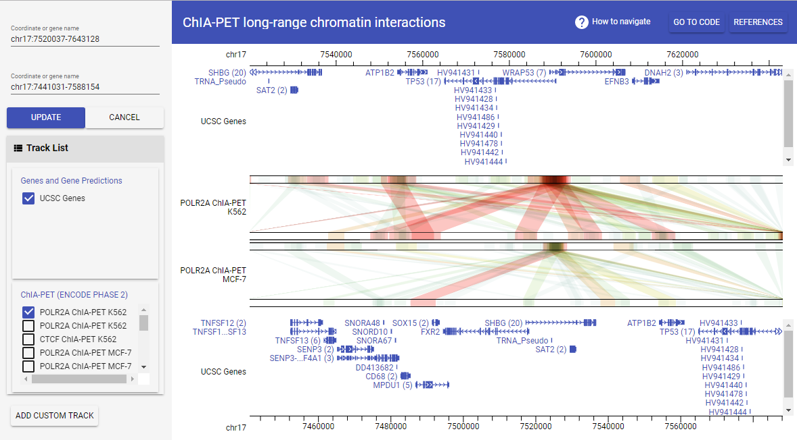

# GIVE Tutorial 2.1: Easy local deployment of GIVE with GIVE-Docker

**Table of Contents**
---------
* [Introduction to GIVE-Docker](#introduction-to-give-docker)  
* [How to use GIVE-Docker?](#how-to-use-give-docker)
    * [4-steps to deploy GIVE](#4-steps-to-deploy-give)
    * [Configure The Host Server for Web Accessibilit](#configure-the-host-server-for-web-accessibility) 
    * [Use GIVE-HUG in GIVE-Docker](#use-give-hug-in-give-docker)
    * [Essential tips for adding data to GIVE container](#essential-tips-for-adding-data-to-give-container)


## Introduction to GIVE-Docker

The traditional way to deploy web service needs to install dependencies and configure environment at the operating system level. Although we already supplied a comprehensive tutorial for system-level [custom installation of GIVE](2.2-custom-installation.md), it's hard for users who lack experience in Linux administration to follow. Even expert users find it annoying. 

Here, we provide a modern approach to deploy GIVE, **GIVE-Docker**. We built GIVE-Docker based on [Docker container technology](https://www.docker.com/what-container). It's an operating-system-level virtualization technology that makes, build, ships and deploys standardized software and web service much easier as well as more elegantly without performance drop. Following this tutorial, you can set a completed genome browser on your computer in minutes. We recommend all users to use GIVE-Docker for deployment. 

The GIVE-Docker image is published on [DockerHub](https://hub.docker.com/r/zhonglab/give/). It's built on a [LAMP on Ubuntu container](https://hub.docker.com/r/linode/lamp/). Scripts for building GIVE-Docker can be found in our [GIVE-Docker GitHub Repo](https://github.com/Zhong-Lab-UCSD/GIVE-Docker). 
The GIVE-Docker image delivers an already configured GIVE with LAMP environment (Apache2, MySQL and PHP on Linux), [data hub and GIVE-HUG](./1.1-GIVE-Hub.md), [GIVE-Toolbox](./3-GIVE-Toolbox.md), a pre-built demo genome browser of [Demo2-ENCODE2_ChIA-PET](../gallery/Demo2-ENCODE2_ChIA-PET), and a set of example data for learning the usages of [GIVE-Toolbox](./3-GIVE-Toolbox.md). Besides, the `root` account password of MySQL in GIVE-Docker is `Admin2015`.

## How to use GIVE-Docker?
### 4-steps to deploy GIVE
- **Install Docker CE**
  
  If Docker was not installed on your computer, please download and install [Docker CE]( https://www.docker.com/community-edition). It's very easy to install and supports all the mainstream operating systems and cloud computing services, such as Mac OS, Windows 10, Ubuntu, AWS and AZURE. 
  After installation, you need to start the Docker service. For Windows and Mac OS users, just start the installed Docker software. For Linux users, you need to run the following command with root privileges. 
  ```
  service docker start
  ```
   
- **Pull GIVE-Docker from [Docker Hub](https://hub.docker.com/r/zhonglab/give/)**

  As we published GIVE-Docker on [Docker Hub](https://hub.docker.com/r/zhonglab/give/), it is easy to pull GIVE-Docker with a command.
  ```
  docker pull zhonglab/give
  ```

- **Run GIVE-Docker container**

  Execute the following command, then a GIVE container named as `give` will run in background. The `-p` arguments set ports mapping to 80 (http) and 443 (https) ports of host server. The port number of Docker container is usually in range of 32768 ~ 61000. We use 40080 and 40443 in all the related tutorials, which can be changed if you want.
  ```
  docker run -d -it -p 40080:80 -p 40443:443 --name give zhonglab/give
  ```

- **Test the built-in [Demo2-ENCODE2_ChIA-PET](../gallery/Demo2-ENCODE2_ChIA-PET) genome browser**
   
   In the previous `docker run` command, `-p` options map three ports for communication between the operating system and GIVE container. With the mapping ports `40080 -> 80`(for http) and `40443 -> 443`(for https), you can use your web browser to open the built-in Demo2-ENCODE2_ChIA-PET genome browser with following URLs. It works like a standalone application on your computer. 
   [http://localhost:40080](http://localhost:40080) (Recommended)
   [https://localhost:40443](https://localhost:40443) (You may see privacy errors from your browser when visiting localhost via https. [Please refer to this page for potential solutions.](https://letsencrypt.org/docs/certificates-for-localhost/))
   
   > Tips: If you are using Docker Toolbox instead of Docker CE on an old Operating System or Windows 10 home edition, the `localhost` needs to be changed to "192.168.99.100".
   

### Configure The Host Server for Web Accessibility
  After the 4 steps of deployment, you will get a local GIVE service. You can use it like a standalone application without internet access. If your host server is web accessible (can be accessed by other people through internet with HTTP/HTTPS), then you can configure the GIVE Docker container for using GIVE service remotely, like using our GIVE Data Hub.
  
  In fact, you only need to set the `give.Host` variable to the domain name and port of your host server in the file  `/var/www/give/html/components/basic-func/constants.js`. The default value in GIVE-Docker is set as `give.Host = 'http://localhost:40080'`. You need to replace the default the value with your `<domain name>:<port>`, such as `give.Host = 'http://give.genemo.org:40080'`.
   
  We provide a shell script tool `config_host.sh` for configuring the host server. Just run the following command line in the `give` container. Learn how to login to the container using `docker exec` command in the [essential tips section](#essential-tips-for-adding-data-to-give-container). To learn more about `config_host.sh` and other tools in GIVE-Toolbox, please read [GIVE-Toolbox tutorial](3-GIVE-Toolbox.md). 
  ```
  docker exec -t -i give /bin/bash
  bash config_host.sh -r /var/www/give -d "http://give.genemo.org:40080"
  ```
### Use GIVE-HUG in GIVE-Docker 
  You should know the GIVE-HUG in GIVE Data Hub, which makes customizing and sharing gneome browser much easier in single HTML file. The GIVE-HUG is also integrated in GIVE-Docker. You can use the URL "http://<domain name>:<port>/data-hub.html" to access the local data hub on your host server and utilize GIVE-HUG to generate customized genome browser in single HTML file. Please check [the tutorial of GIVE Data Hub](./1.1-GIVE-Hub.md) for more information. 
   > Tips:
      - If your host server is not web accessible, i.e., the `give` container is running in standalone mode, the HTML files generated by GIVE-HUG can only be locally used on your host server. It's not shareable to others.
      - The `give.Host` env variable in the file `/var/www/give/html/components/basic-func/constants.js` is important to GIVE-HUG. It must be correctly set to ensure the generated HTML can work properly. You can use the shell script tool `config_host.sh` in [GIVE-Toolbox](./3-GIVE-Toolbox.md) to configure it. 
      - In standalone mode, the default value of `give.Host` is "http://localhost:40080". You can access the data hub and use GIVE-HUG with URL "http://localhost:40080". If other port number was used in your `give` container, you need to change the value according to your settings.
      - In web service mode, i.e., you have correctly set the `give.Host` value to your `<domain name>:<port>`, you should always access data hub by `<domain name>:<port>/data-hub.html` to make sure the generated HTML is shareable. 

### Essential tips for adding data to GIVE container
After successfully deploying GIVE, you can utilize the power of GIVE to build your own genome browser. You can learn how to add your own data to your GIVE data source using GIVE-Toolbox in [GIVE Tutorial 3](3-GIVE-Toolbox.md). If you want to directly use MySQL commands (_NOT recommended_), you can read [manual 3.2. MySQL commands for managing data in GIVE data source](../manuals/3.2-dataSource.md).

Here, we give you some essential tips on using GIVE container. You can read [Docker official docs](https://docs.docker.com/get-started/) to learn more of Docker usage.
- Login to GIVE container
  
  You can login to the running GIVE container `give` as root for further operations.
  ```
  docker exec -t -i give /bin/bash
  ```
  Alternatively, you can also directly login to the MySQL database of the container `give`.
  ```
  docker exec -t -i give mysql -u root -p
  ```
  The password of MySQL `root` account is `Admin2015`.

- Transfer files
  
  You can transfer files between GIVE container and operating system by using `docker cp` command. The following commands are examples.
  ```
  # run GIVE-Docker container, named as give
  docker run -d -it -p 40080:80 -p 40443:443 -p 43306:3306 --name give zhonglab/give
  # copy file test.sh from OS to the container give
  docker cp ~/test.sh give:/tmp/test.sh
  # copy file from the container give to OS
  docker give:/tmp/test.sh ~/test.sh
  ```
- Stop, restart and remove running container
  
  You can use `docker ps -a` to check all the running and exited containers. You can stop, restart and remove them. Keep in mind that you will lose all the changes that have been made to the running container after you remove it.
  ```
  docker stop give
  docker restart give
  docker rm give
  ```
- Backup data of GIVE container
  
  **Keep in mind that all the custom changes made to container do not affect the Docker image, so when you remove a container you will lose all the data.** If you want to save data in the container, such as MySQL data, there are at least three approaches to do it. 
  - Use `docker commit` and `docker save` to save the whole container, and use `docker load` to restore it.
    
    ```
    docker commit -p give give-custom
    docker save -o ~/give-custom.tar give-custom
    docker load -i ~/give-custom.tar
    ```
  - Use **Docker Volume** `-v` option to assign a host dir for saving data when you start the container. For example, in the following command, the dir `/tmp/hostDir` will be mounted to the MySQL data dir in the GIVE-Docker container. All the changes you made to the MySQL databases in the container are saved in the host dir `/tmp/hostDir`.
    
    ```
    docker run -d -it -v /tmp/hostDir:/var/lib/mysql -p 40080:80 -p 40443:443 -p 43306:3306 --name give zhonglab/give
    ```
  
  - Use **Data Container**. Check [this tutorial](https://www.digitalocean.com/community/tutorials/how-to-share-data-between-docker-containers) to learn more.
