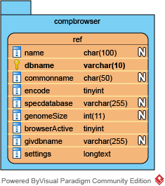
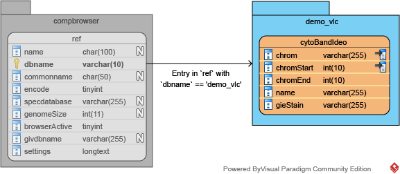
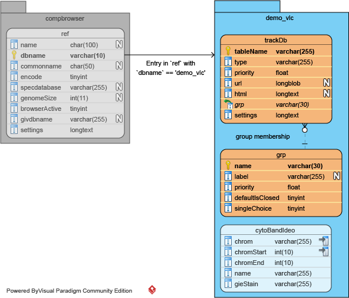
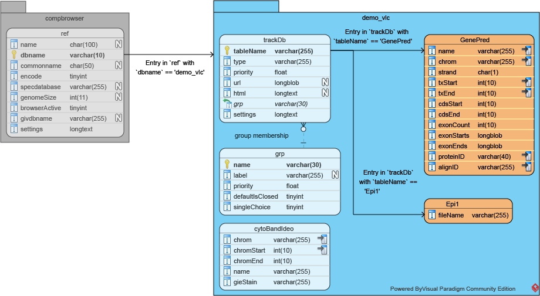

# GIVE Tutorial 2: Populating a reference genome with a few data tracks on a MySQL compatible data source

This tutorial will show you how to use existing code base to implement a customized genome browser with your own data.

## Table of Contents
*   [Prerequisites](#prerequisites)
    *   [Using the MySQL database of Zhong Lab Web Server](#using-the-mysql-database-of-zhong-lab-web-server)
        *   [Using MySQL console](#using-mysql-console)
        *   [Using phpMyAdmin](#using-phpmyadmin)
*   [Demo: creating a *Vulcan* reference genome and visualize something on it](#demo-creating-a-vulcan-reference-genome-and-visualize-something-on-it)
    *   [Preparation](#preparation)
    *   [Creating a new reference genome](#creating-a-new-reference-genome)
    *   [Creating a track group table and a track annotation table](#creating-a-track-group-table-and-a-track-annotation-table)
    *   [Create track groups](#create-track-groups)
    *   [Adding gene annotations](#adding-gene-annotations)
    *   [Adding interactions](#adding-interactions)
    *   [Adding one epigenetic track](#adding-one-epigenetic-track)
    *   [Epilogue](#epilogue)
*   [Database table properties documentation](#database-table-properties-documentation)

## Prerequisites

To follow the tutorial, a functional MySQL-compatible instance and a PHP web server is required.

To install a MySQL-compatible instance, you can choose either of the following:
*   [MySQL community server](https://dev.mysql.com/downloads/mysql/)
*   [MariaDB](https://downloads.mariadb.org/)

You may also follow the instructions here to install PHP to your web server:

*   [PHP installation and configuration](http://php.net/manual/en/install.php)

If you haven't set up your web server, please refer to [Tutorial 1, Part "Prerequisites"](knownCodeDataSource.md#prerequisites) for instructions.

### Using the MySQL database of Zhong Lab Web Server

A demo server at `demo.give.genemo.org` has been set up to provide a working MariaDB instance you may use in this tutorial. Please go to the following address to request an account and create a reference database:

```
[https://demo.give.genemo.org/getDemoUser.html](https://demo.give.genemo.org/getDemoUser.html)
```


#### Using MySQL console

If you have a user account at the server, you may use the following command in a console to login:

```sh
$ mysql -u givdemo -p
Enter password: <password>
```

When you logged in successfully, you'll see something like the following in your console:

```text
Welcome to the MariaDB monitor.  Commands end with ; or \g.
Your MariaDB connection id is 28348
Server version: 10.1.21-MariaDB-1~xenial mariadb.org binary distribution

Copyright (c) 2000, 2016, Oracle, MariaDB Corporation Ab and others.

Type 'help;' or '\h' for help. Type '\c' to clear the current input statement.

MariaDB [(none)]>_
```

#### Using phpMyAdmin

The MariaDB instance on `demo.give.genemo.org` can also be accessed via phpMyAdmin at <https://demo.give.genemo.org/phpmyadmin/>, just use the previous username and password to login.

*__Note:__ While there will probably be easier and more straightforward ways for almost every command, it is still possible to directly edit SQL command in phpMyAdmin. Therefore, this tutorial will only provide the SQL command to use in all the operations.*

__CAUTION:__ In SQL commands, single quotes (`''`) and double quotes (`""`) can both be used to quote strings (but not mixed use, so `'"` and `"'` is not good). There are also __backtick quotes (`` `` ``)__ used to quote table names, column names, etc, and they cannot be replaced by single or double quotes typically. Please make sure which quote is present in the command given.

## Demo: creating a *Vulcan* reference genome and visualize something on it

Here we will demonstrate an example of using GIVE with the MySQL data source on Zhong Lab server.

> *It's the 2260s. Human beings have mastered the technologies required in intergalactic travel.* USS Enterprise *was just launched a few years ago to explore the final frontier of space.*
>
> *However, the understanding of our sibling sentient species is still quite lacking. For example, our knowledge of the mystic species of* Vulcans *is extremely limited, despite almost 200 years of contact between them and us.*
>
> *News came that scientists have just assembled the entire genome from a* Vulcan *subject, got a few annotations done and measured some epigenetic signals. There are obviously a lot of work to do, but we would like to check if we can see anything from what we already got.*

### Preparation

To facilitate connection between GIVE server and the database source, a database named `compbrowser` needs to be created on the source.

*__Note:__ If you are using the MariaDB instance on demo.give.genemo.org, then those tables are already there and you can skip this step.*
```SQL
CREATE DATABASE `compbrowser`;
```
Within the `compbrowser` database, a `ref` table is needed to store the properties of all supported references:
```SQL
CREATE TABLE `compbrowser`.`ref` (
 `name` char(100) DEFAULT NULL,   -- The name of the species of the reference
 `dbname` char(30) NOT NULL DEFAULT '',   -- The database name
 `commonname` char(50) DEFAULT NULL,      -- The common name of the species
 `encode` tinyint(4) NOT NULL,            -- Whether it's part of ENCODE
 `specdatabase` varchar(255) DEFAULT NULL,    -- Reserved for GeNemo use
 `genomeSize` int(11) unsigned DEFAULT NULL,  -- Reserved for GeNemo use
 `browserActive` tinyint(1) NOT NULL DEFAULT '0', -- Whether the ref is active
 `givdbname` varchar(255) NOT NULL,        -- Reserved for GeNemo use
 `settings` longtext NOT NULL,    -- Detailed settings for the reference, JSON format
 PRIMARY KEY (`dbname`)
)
```

The data source will have a data structure as shown below:



### Creating a new reference genome

> *Preliminary examinations revealed that this sample greatly resembles an ancient human genome assembly published about 250 years ago, the NCBI* `GRCh37` *(UCSC* `hg19` *). This is very intriguing and has casted doubt on the validity of the sample, but at least it will be easy for us to see.*

To visualize a new reference genome, GIVE only needs to know 1) the names of the species for this reference (Latin and common names are recommended but any name should work), 2) its chromosomal information, including names, sizes and the location of centromeres. These are stored in two locations within the data source, which can be done in the following steps:

1.  Create a separate database for the reference, this database will be used to store all the track information within this species;

    *__Note:__ If you are using the MariaDB instance on demo.give.genemo.org, __please skip this step and go to step 2. Use the given database name in following steps.__*
    ```SQL
    CREATE DATABASE `demo_vlc`;   -- *** Replace `demo_vlc` with your own DB name ***
    ```
2.  Create a `cytoBandIdeo` table with chromosomal information in the *Vulcan* species database;
    ```SQL
    CREATE TABLE `demo_vlc`.`cytoBandIdeo` (  -- *** Replace `demo_vlc` with your own DB name ***
      `chrom` varchar(255) NOT NULL,          -- Chromosomal name
      `chromStart` int(10) unsigned NOT NULL, -- Start coordinate for the band
      `chromEnd` int(10) unsigned NOT NULL,   -- End coordinate for the band
      `name` varchar(255) NOT NULL,           -- Name of the band
      `gieStain` varchar(255) NOT NULL,       -- Giemsa Stain info, to identify bands, centromeres, etc.
      KEY `chrom` (`chrom`(23),`chromStart`)
    );
    ```

    The data source will now have a data structure as shown below (existing components not changed in structure are greyed out):

    

3.  Populate the `cytoBandIdeo` table. Since the presumed *Vulcan* genome is very similar to `hg19`, we can use the `cytoBandIdeo` table in UCSC `hg19` instead. The data for `cytoBandIdeo` of `hg19` can be downloaded from UCSC server at <http://hgdownload.cse.ucsc.edu/goldenpath/hg19/database/cytoBandIdeo.txt.gz>. You can use SQL command to load the __decompressed file__ into the table.
    ```SQL
    LOAD DATA LOCAL INFILE "<your file path>/cytoBandIdeo.txt" INTO TABLE `demo_vlc`.`cytoBandIdeo`;
    ```
4.  Add one entry in table `ref` of database `compbrowser`, notice that the `browserActive` field needs to be set to `1` and in the `settings` field, the JSON string also has its `browserActive` attribute set as `true`; (You may want to try <http://www.objgen.com/json> to get a JSON string with ease.)

    *__Note:__ If you are using the MariaDB instance on sysbio.ucsd.edu, __please use your own db names to avoid naming conflicts.__ All db names should start with `demo_`.*
    ```SQL
    INSERT INTO `compbrowser`.`ref` (
      `name`,
      `dbname`,
      `commonname`,
      `browserActive`,
      `settings`
    )
    VALUES (
      'Vulcan',
      'demo_vlc',   -- *** Please change this name to your own        ***
      -- *** Note that for the tutorial it should begin with 'demo_'. ***
      -- *** This will be referred to as your own DB name in the      ***
      -- ***     comment of codes following.                          ***
      'Vulcan',
      1,            -- Make it active
      '{
        "browserActive": true
      }'            -- Same here, make it active
    );
    ```

With these steps done, you will be able to specify the *Vulcan* reference in embedded GIVE browser. (Please refer to [Tutorial 1, Part "Embedding a full-fledged genome browser in existing pages"](knownCodeDataSource.md#embedding-a-full-fledged-genome-browser-in-existing-pages) about how to embed GIVE browser in your web page.)
```html
<script src="https://demo.give.genemo.org/components/bower_components/webcomponentsjs/webcomponents-lite.min.js"></script>
<link rel="import" href="https://demo.give.genemo.org/components/bower_components/genemo-visual-components/chart-controller/chart-controller.html">

<!-- ****** Replace `demo_vlc` in the next line with your own DB name ****** -->
<chart-controller ref="demo_vlc" group-id-list='["genes", "epigenetics"]'>
</chart-controller>
```
Since there was no tracks at all, the only thing you can see in the reference is the chromosomal coordinates. However, this is gonna change soon.

### Creating a track group table and a track annotation table

Tracks in GIVE belongs to track groups for better management and these groups need their place in the database. To create a track group, create a `grp` table in the reference database if it doesn't have one already;
```SQL
CREATE TABLE `demo_vlc`.`grp` (                   -- *** Replace `demo_vlc` with your own DB name ***
  `name` char(255) NOT NULL DEFAULT '',           -- Name of the group
  `label` char(255) NOT NULL DEFAULT '',          -- Long label of the group
  `priority` float NOT NULL DEFAULT '0',          
  -- Order for this group in the browser, less is upper
  `defaultIsClosed` int(11) DEFAULT NULL,         -- Whether the group will be closed by default, reserved
  `singleChoice` tinyint(1) NOT NULL DEFAULT '0'
  -- Whether the group will only allow one track to be active at any time
);
```
Tracks themselves also need a place to store their annotation and data, therefore, a `trackDb` table is also needed in our *Vulcan* reference database.
```SQL
CREATE TABLE `demo_vlc`.`trackDb` (     -- *** Replace `demo_vlc` with your own DB name ***
  `tableName` varchar(150) NOT NULL,    -- Name of the track table
  `type` varchar(255) NOT NULL,         -- Type of the track (**Important**)
  `priority` float NOT NULL,            -- Order for the track (within group)
  `url` longblob,                       -- URL for the track, reserved
  `html` longtext,                      -- HTML description for the track, reserved
  `grp` varchar(255) NOT NULL,          -- Group of the track, should be the same as grp.name
  `settings` longtext NOT NULL,         -- Detailed track settings, JSON format
  PRIMARY KEY (`tableName`)
);
```

The updated data structure as shown below (existing components not changed in structure are greyed out):



### Create track groups

Creating track groups is quite straightforward. Just add an entry of the group you would like to create in the `grp` table and you are good to go. In this demo, we will create two track groups, one for gene annotation (`genes`) and the other for epigenetic data (`epigenetics`).

```SQL
INSERT INTO `demo_vlc`.`grp` VALUES ( -- *** Replace `demo_vlc` with your own DB name ***
  'genes',                          -- Group name
  'Genes and Gene Predictions',     -- Group long label
  3,                                -- Priority
  0,
  0
), (
  'epigenetics',
  'Epigenetic Signals',
  4,
  0,
  0
), (
  'interactions',
  'Genomic Interactions',
  5,
  0,
  0
);
```

### Adding gene annotations

> *While the actual evidence for* Vulcan *genes are very slim, given its close relationship to the ancient* `hg19` *reference, it appears that whoever generated the annotations just used the human annotation as a guidance to predict where all those* Vulcan *genes may be.*

After track groups were created, we can add tracks into the groups to display. Adding tracks to GIVE database typically involves two steps: one for metadata and one for data.

1.  Add the gene annotation data to the database.
    *   Create a `GenePred` table for gene annotation data;

        *__Note:__ This is different than BED12 format: 1) field order is slightly different; 2) the 9th and 10th column represents the start and end coordinate of all the exons, instead of the start within the gene and length of the exon in BED12.*
        ```SQL
        CREATE TABLE `demo_vlc`.`GenePred` ( -- *** Replace `demo_vlc` with your own DB name ***
          `name` varchar(255) NOT NULL DEFAULT '',
          `chrom` varchar(255) NOT NULL DEFAULT '',
          `strand` char(1) NOT NULL DEFAULT '',
          `txStart` int(10) unsigned NOT NULL DEFAULT '0',
          `txEnd` int(10) unsigned NOT NULL DEFAULT '0',
          `cdsStart` int(10) unsigned NOT NULL DEFAULT '0',
          `cdsEnd` int(10) unsigned NOT NULL DEFAULT '0',
          `exonCount` int(10) unsigned NOT NULL DEFAULT '0',
          `exonStarts` longblob NOT NULL,
          `exonEnds` longblob NOT NULL,
          `proteinID` varchar(40) NOT NULL DEFAULT '',
          `alignID` varchar(255) NOT NULL DEFAULT '',
          KEY `name` (`name`),
          KEY `chrom` (`chrom`(16),`txStart`),
          KEY `chrom_2` (`chrom`(16),`txEnd`),
          KEY `protein` (`proteinID`(16)),
          KEY `align` (`alignID`)
        );
        ```
    *   Populate the `GenePred` table with actual data.
        The annotation data we are going to use in this demo is at <https://sysbio.ucsd.edu/public/xcao3/UFPArchive/genepred.txt> and you may use `LOAD DATA LOCAL INFILE` to add them to the `GenePred` table.
        ```SQL
        LOAD DATA LOCAL INFILE "<your file path>/genepred.txt" INTO TABLE `demo_vlc`.`GenePred`;
        ```
2.  Add the gene annotation track metadata in `trackDb` table;
    ```SQL
    INSERT INTO `demo_vlc`.`trackDb` VALUES ( -- *** Replace `demo_vlc` with your own DB name ***
      'GenePred',                   -- Track table name
      'genePred',                   -- Track type: gene and gene prediction
      1,
      NULL,
      NULL,
      'genes',                      -- Group name, should be the same as grp.name
      '{
        "group":"genes",
        "longLabel":"Predicted Genes for presumed Vulcan sample (by comparing against hg19)",
        "priority":1,
        "shortLabel":"Predicted Genes",
        "track":"GenePred",
        "type":"genePred",
        "visibility":"pack",
        "adaptive":true
      }'
    );
    ```

### Adding interactions

> *While the actual evidence for* Vulcan *genes are very slim, given its close relationship to the ancient* `hg19` *reference, it appears that whoever generated the annotations just used the human annotation as a guidance to predict where all those* Vulcan *genes may be.*

Adding interaction tracks (in `interaction` format) is similar to adding `BED` or `GenePred` tracks. It also involves a data part and a metadata part.

1.  Add the interaction data to the database.
    *   Create a `interaction` table for gene annotation data;

        *__Note:__ This is the interaction format converted for database use. Each interaction component will take at least two rows (one for each end) and linked by having the same `linkID`.*

        ```SQL
        CREATE TABLE `demo_vlc`.`newInteraction` ( -- *** Replace `demo_vlc` with your own DB name ***
          `ID` int(10) unsigned NOT NULL AUTO_INCREMENT,
          `chrom` varchar(255) NOT NULL DEFAULT '',
          `start` int(10) unsigned NOT NULL DEFAULT '0',
          `end` int(10) unsigned NOT NULL DEFAULT '0',
          `linkID` int(10) unsigned NOT NULL DEFAULT '0',
          `value` float NOT NULL DEFAULT '0',
          `dirFlag` tinyint(4) NOT NULL DEFAULT '-1',
          PRIMARY KEY (`ID`),
          KEY `chrom` (`chrom`(16),`start`),
          KEY `chrom_2` (`chrom`(16),`end`),
          KEY `linkID` (`linkID`)
        )
        ```
    *   Populate the `GenePred` table with actual data.
        The annotation data we are going to use in this demo is at <https://sysbio.ucsd.edu/public/xcao3/UFPArchive/newInteraction.txt> and you may use `LOAD DATA LOCAL INFILE` to add them to the `newInteraction` table.
        ```SQL
        LOAD DATA LOCAL INFILE "<your file path>/newInteraction.txt" INTO TABLE `demo_vlc`.`newInteraction`;
        ```
2.  Add the new interaction track metadata in `trackDb` table;
    ```SQL
    INSERT INTO `demo_vlc`.`trackDb` VALUES ( -- *** Replace `demo_vlc` with your own DB name ***
      'newInteraction',             -- Track table name
      'interaction',                -- Track type: interaction
      1,
      NULL,
      NULL,
      'interaction',                      -- Group name, should be the same as grp.name
      '{
        "group":"interaction",
        "longLabel":"Genomic interaction for presumed Vulcan sample",
        "priority":1,
        "shortLabel":"Genomic Interaction",
        "track":"newInteraction",
        "type":"interaction"
      }'
    );
    ```

### Adding one epigenetic track

> *Interestingly, there seem to be few discrepancies with the gene prediction data from human when annotating the presumed* Vulcan *sample. We haven't seen the epigenetic signal on the genome yet, but it appears that more caution would be better than less.*

Adding epigenetic tracks (in `bigWig` format) is actually easier than `BED` or `GenePred` tracks. It also involves a data part and a metadata part.

1.  Add the epigenetic data to the database.
    *   Create a table for epigenetic data;
        ```SQL
        CREATE TABLE `demo_vlc`.`Epi1` (  -- *** Replace `demo_vlc` with your own DB name ***
          `fileName` varchar(255) NOT NULL
        );
        ```
    *   For bigWig tracks, only the URL of the data file (<https://sysbio.ucsd.edu/public/xcao3/UFPArchive/vulcanCandidate.bigWig>) needs to be filled in the table.
        ```SQL
        INSERT INTO `demo_vlc`.`Epi1` VALUES (  -- *** Replace `demo_vlc` with your own DB name ***
          'https://sysbio.ucsd.edu/public/xcao3/UFPArchive/vulcanCandidate.bigWig'
        );
        ```
2.  Add the epigenetic track metadata in `trackDb` table;
    ```SQL
    INSERT INTO `demo_vlc`.`trackDb` VALUES ( -- *** Replace `demo_vlc` with your own DB name ***
      'Epi1',
      'bigWig',
      1,
      NULL,
      NULL,
      'epigenetics',
      '{
        "autoScale":false,
        "group":"epigenetics",
        "dataType":"ChipSeq",
        "cellType":"Lymphocyte",
        "trackFeature":"H3K4me3",
        "trackID":"ChIPSeq_H3K4me3_Lymph",
        "labName":"UFP Bio-lab #4201",
        "groupDataType":"ChIP-Seq",
        "groupFeature":"H3K4me3",
        "groupSampleType":"B-lymphocytic",
        "longLabel":"ChIP Sequencing data with H3K4me3 for presumed Vulcan lymphocyte",
        "priority":1,
        "shortLabel":"H3K4me3 (Lymphocyte)",
        "track":"Epi1",
        "type":"bigWig",
        "visibility":"full"
      }'
    );
    ```

The final data structure as shown below (existing components not changed in structure are greyed out):



> *The striking resemblance of the presumed* Vulcan *genome and epigenome has attracted great attention throughout UFP. However, lots of skeptical UFP scientists, including us, also doubted given such resemblance whether this set of data is genuinely from a* Vulcan *subject, or from some human origin.*

### Epilogue

> *To further clarify the source of this presumed sample, the bio-lab conducting the research turned to experts of all fields. It is at that time when a intelligence forensic expert detected traces of intrusion in one of the workstations from the lab.*
>
> *Apparently the* Vulcan *subject tricked the bio-lab technicians by replacing the dataset for his sample with a recovered ancient dataset, which explains such high resemblance perfectly.*
>
> *While the recovered dataset, being more than 250 years ago, has its intrinsic archaeological value, and the way the* Vulcan *subject recovered such ancient data presents their highly advanced technology in digital media restoration. We are definitely out of luck this time and would need to wait for another chance in the future. Maybe when* USS Enterprise *returns to the earth, we can try to contact one of the crew onboard.*

## Database table properties documentation

Here are a brief description of the properties you may use in the `settings` column of `trackDb`:

__shortLabel__  
> Type: `String`  
> Default: `''`  
> The short label shown by the track.

__longLabel__  
> Type: `String`  
> Default: `''`  
> The long label providing more information. Reserved.

__visibility__  
> Type: `enum` (`'full'`, `'pack'`, `'collapsed'`, `'dense'`, and `'hide'`)  
> Default: `'hide'`  
> The visibility of the track, left is more visible/prominent.

__adaptive__  
> Type: `Boolean`  
> Default: `false`  
> Whether the visibility will adapt to the height of the ending result. If the height exceeds certain threshold, the visibility will be degraded by one.

__dataType__, __cellType__, __trackFeature__, __labName__,  
__groupDataType__, __groupFeature__, __groupSampleType__  
> Type: `String`  
> Default: `null`  
> These are metadata of the tracks. Reserved for future features.
