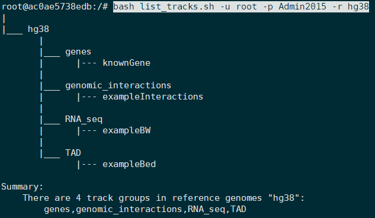
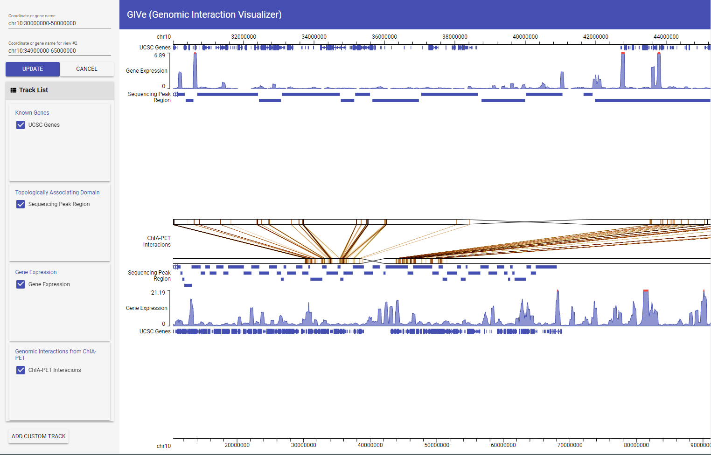

# GIVE Tutorial 3: Use GIVE-Toolbox to manage data tracks 

**Table of Contents**
---------
* [Introduction](#introduction)  
* [Walkthrough Example](#walkthrough-example)
    * [Step 1: Deployment of GIVE](#step-1-deployment-of-give)
    * [Step 2: Initialization and Create Reference Genome](#step-2-initialization-and-create-reference-genome) 
    * [Step 3: Create Track Groups](#step-3-create-track-groups)
    * [Step 4: Create Gene Annotation Track](#step-4-create-gene-annotation-track)
    * [Step 5: Create Data Track from bed File](#step-5-create-data-track-from-bed-file)
    * [Step 6: Create Data Track from bigWig File](#step-6-create-data-track-from-bigwig-file)
    * [Step 7: Create Data Track from interaction File](#step-7-create-data-track-from-interaction-file)
    * [List and Remove Data Tracks](#list-and-remove-data-tracks)
    * [Using The Customized GIVE Genome Browser](#using-the-customized-give-genome-browser)


## Introduction
GIVE-Toolbox is a set of shell(bash) scripts that relieves users from writing MySQL commands. GIVE uses MySQL in the back end for data management. Users who do not want to directly work with MySQL can choose to use GIVE-Toolbox. GIVE-Toolbox offers all the equivalent functions and capabilities as directly writing MySQL commands. GIVE-Toolbox simplifies the operations for configuring and initializing data sources, as well as building and managing data tracks. In the following walk-through example, we will build a customized genome browser in 7 steps. 

If you would like to know the actual operations in MySQL, please refer to [GIVE manual 3.2: MySQL commands for managing data in GIVE data source](../manuals/3.2-dataSource.md).

GIVE support `gene annotation`, `bed`, `bigWig` and `interaction` data tracks. Here are some documents regarding the format definitions and related visualizing options in GIVE: 
- [gene annotation](../manuals/4.4-geneAnnotation.md): Gene annotation files in UCSC gene table format can be download from UCSC Table Browser.
- [`bed` Tracks](../manuals/4.1-bed.md)
- [`bigWig` Tracks](../manuals/4.2-bigwig.md)
- [`interaction` Tracks](../manuals/4.3-interaction.md)

The current version of GIVE-Toolbox includes 9 script tools. These tools can meet all the needs of configuring and managing GIVE data source. Please also read [manual 3.1 GIVE-Toolbox usages for managing data in GIVE data source](../manuals/3.1-GIVE-Toolbox-usages.md) for the detail of usage and arguments of each script tool.

- `config_host.sh`: set configurations for GIVE service
- `initial_ref.sh`: initialize MySQL database structure and build reference genome database
- `add_track_geneAnnot.sh`: add gene annotation track from UCSC gene table file
- `add_trackGroup.sh`: add track group
- `add_track_bed.sh`: add data track from `bed` format data file
- `add_track_bigWig.sh`: add data track from `bigWig` format data file
- `add_track_interaction.sh`: add data track from `interaction` format data file
- `list_tracks.sh`: list the tree structure of whole GIVE data source or a specified track group, or detail settings of a specified data track
- `remove_data.sh`: remove a track, a track group (all the tracks in the track group will be removed) or a whole reference genome (all the track groups and tracks in the reference genome will be removed)

## Walkthrough Example

This walk-through example will show you how to use GIVE-Toolbox to easily build a customized GIVE genome browser. It includes 7 steps. In each step, you just need to run one or two bash command lines. All the data in the example can be found in the `example_data` folder.

For utilizing GIVE-Toolbox with different GIVE deployment approaches:
- [GIVE-Docker](./2.1-GIVE-Docker.md): GIVE-Toolbox is integrated in the GIVE-Docker. When you run a GIVE container and log into the container system (bash terminal), all the script tools can be directly executed with their names, which are located in system path `/usr/local/bin` (the container system). The `example_data` is in the `/tmp` path (the container system). 
- [Custom installation](./2.2-custom-installation.md): You need to clone the GIVE GitHub repository and install it correctly . `GIVE-Toolbox` folder is included in the cloned GIVE repo. You can use these tools with their directory like `bash ~/GIVE/GIVE-Toolbox/add_track_bed.sh -u ...`. For convenience, you can set all these tools executable (using `chmod +x` command to them) and copy them to a system path folder (such as `/usr/local/bin` or declare some path in your `.bashrc` file). Then you can directly run these tools.

### Step 1: Deployment of GIVE
  
  First of all, you need to deploy GIVE on your local machine. You can use [GIVE-Docker](./2.1-GIVE-Docker.md) (recommended) or [custom install GIVE](./2.2-custom-installation.md).
  
  **TO ensure the consistency of system environment, this walk-through example is based on GIVE-Docker.** We can use only two command lines to deploy GIVE on your local machine using GIVE-Docker. Please learn how to use GIVE-Docker from [GIVE Tutorial 2.1: Easy local deployment of GIVE with GIVE-Docker](./2.1-GIVE-Docker.md). 
  
  ```bash
  # pull GIVE-Docker image from Docker-Hub
  docker pull zhonglab/give
  # run a GIVE container named as "give"
  docker run -d -it -p 40080:80 -p 40443:443 --name give zhonglab/give
  ```
  
  The following command lines will lead you to the internal of "give" container with a bash terminal. Then you can execute the commands of the step 2-7 in it. 
  
  ```bash
  # log into "give" container 
  docker exec -it give /bin/bash 
  ```
  
  Only if your host server is web accessible (Apache2 or other web server installed), then you can set the host domain name using `config_host.sh` tool to use GIVE genome browser remotely through internet. In this example, the domain of our host server is "http://give.genemo.org". As we are using GIVE-Docker container with HTTP port 40080, so we need to set the host domain name as "http://give.genemo.org:40080".

  ```
  # set host domain name, only if your local machine is web accessible
  bash config_host.sh -r /var/www/give -d "http://give.genemo.org:40080"
  ```
### Step 2: Initialization and Create Reference Genome

  There is already a built-in reference genome `hg19`. Hence, here we initialize a new genome reference `hg38`. Just one command is enough. It uses the cytoBandIdeo file of hg38 in the `/tmp/example_data` folder, which was downloaded from [UCSC genome annotation database](http://hgdownload.cse.ucsc.edu/goldenpath/hg38/database/).
  ```bash
  bash initial_ref.sh -u root -p Admin2015 -r hg38 -s "Homo sapiens" -c human  -f /tmp/example_data/cytoBandIdeo.txt -w '["chr10:30000000-50000000", "chr10:35000000-60000000"]'
  ```
  Now you have a `hg38` reference genome. You can add data tracks on this reference genome.

### Step 3: Create Track Groups
  
  Every data track in GIVE needs to be assigned to a unique track group. The `add_trackGroup.sh` is designed for creating track group. The following command lines will create three track groups `genes`, `RNA_seq`, `TAD` and `genomic_interactions`. 
  ```
  bash add_trackGroup.sh  -u root -p Admin2015 -r hg38 -g "genes" -l "Known Genes" -o 1 -s 0
  bash add_trackGroup.sh  -u root -p Admin2015 -r hg38 -g "RNA_seq" -l "Gene Expression" -o 2 -s 0
  bash add_trackGroup.sh  -u root -p Admin2015 -r hg38 -g "TAD" -l "Topologically Associating Domain" -o 3 -s 0
  bash add_trackGroup.sh  -u root -p Admin2015 -r hg38 -g "genomic_interactions" -l "Genomic interactions from ChIA-PET" -o 3 -s 0
  ```
  Now you can add data tracks to these track groups.
### Step 4: Create Gene Annotation Track
  
  This command will create a data track named as `knownGene` from `knownGenes.txt` file. 
  ```
  bash add_geneAnnot.sh  -u root -p Admin2015 -r hg38 -t "knownGene" -g "genes" -l "UCSC known genes annotation" -s "UCSC Genes" -o 1 -v full  -f /tmp/example_data/knownGene.txt
  ```
  
### Step 5: Create Data Track from `bed` File

  This command will create a data track named as `exampleBed` in the `peak_region` track group from `example.bed` file. 

  ```
  bash add_track_bed.sh -u root -p Admin2015 -r hg38 -t exampleBed -g "TAD" -l "An example bed track of TAD from HiC" -s "TAD" -o 2 -v pack -f /tmp/example_data/example.bed
  ```
### Step 6: Create Data Track from `bigWig` File
  
  This command will create a data track named as `exampleBW` in the `RNA_seq` track group from `example.bigWig` file. 
  
  ```
  bash add_track_bigWig.sh -u root -p Admin2015 -r hg38 -t exampleBW -g "RNA_seq" -l "An example bigWig from single cell RNAseq" -s "Gene Expression" -o 3 -v full -a true -f /tmp/example_data/example.bigWig
  ```
  
### Step 7: Create Data Track from `interaction` File
  
  This command will create a data track named as `exampleInteractions` in the `genomic_interactions` track group from `example.interacion` file.
  
  ```
  bash add_track_interaction.sh -u root -p Admin2015 -r hg38 -t "exampleInteractions" -g "genomic_interactions" -l "An example genomic interactions from ChIA-PET data" -s "ChIA-PET Interactions" -o 1 -v full -q "0.37,1.32,1.78,2.19,2.60,2.97,3.43,3.85,4.34,4.90,5.48,6.16,6.94,8.01,9.05,10.41,12.37,14.88,19.84,31.77,290.17" -f /tmp/example_data/example.interaction
  ```

### List and Remove Data Tracks

  We also provide tools for listing and removing data tracks, which are `list_tracks.sh` and `remove_data.sh`. 

  With the following command, we can see the tree structure of all the data tracks in reference genome `hg38`.

  ```bash
  bash list_tracks.sh -u root -p Admin2015 -r hg38
  ```
  

  Using `remove_data.sh`, you can remove data track, group or the whole reference genome. The following command will remove the `TAD` track group. After removing, you can use `list_tracks.sh` to view the result.
  ```bash
  bash remove_data.sh -u root -p Admin2015 -r hg38 -g TAD
  ```

### Using The Customized GIVE Genome Browser

  Finally, in only 7 steps, you have built a full customized genome browser with 3 data tracks built from 3 kinds of supported data formats. You can use the genome browser with several lines of HTML code as below. 
  ```html
  <script src="http://localhost:40080/bower_components/webcomponentsjs/webcomponents-lite.min.js"></script>
  <link rel="import" href="http://localhost:40080/components/chart-controller/chart-controller.html">
  <chart-controller ref="hg38" num-of-subs="2"
    group-id-list='["genes", "TAD",  "RNA_seq", "genomic_interactions"]'
    default-track-id-list='["knownGene", "exampleBed", "exampleBW", "exampleInteractions"]'>
  </chart-controller>
  ```
  Copy, paste and save the code into a HTML file, then open it with your web browser to view the genome browser you just built.
  If your local machine is web accessible and the you have correctly set the host domain name in [step 1](#step-1-deployment-of-give), you can use the genome browser remotely. Just modify `http://localhost:40080/` with your host server domain name in the HTML file, such as `http://give.genemo.org:40080` for our host server. Anyone can view your customized genome browser using the HTML file through internet.
  With GIVE-HUG, you can generate HTML file of your customized genome browser much easier. Open the URL `http://localhost:40080/data-hub.html` on local machine or `http://<host domain name>:40080/data-hub.html` in web access mode, you will find your data hub, which lists all the existing data tracks. In HTML generator mode, it can generate a HTML file according to your customization. Please check the tutorial of [GIVE Data Hub](1.1-GIVE-Hub.md) and [GIVE-Docker](2.1-GIVE-Docker.md#use-give-hug-in-give-docker) to learn more.
   


